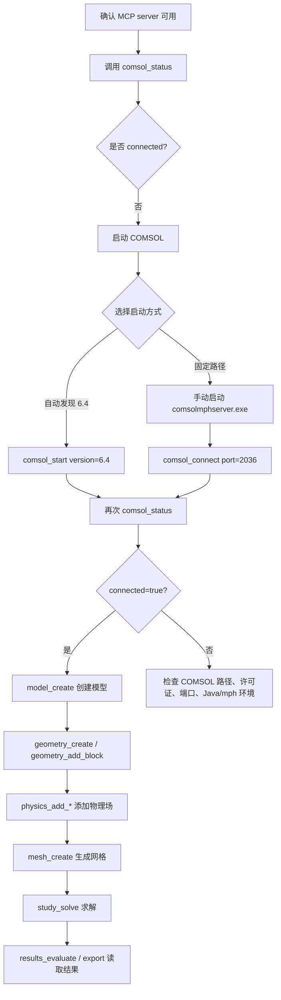

TL;DR：可以。当前 COMSOL MCP 支持通过 `comsol_start(version="6.4")` 启动本地 COMSOL client，但它目前不直接接收 `D:\Softwares_02\COMSOL64` 这种安装路径参数；如果 `mph` 能自动发现 COMSOL 6.4，就可以直接启动。若自动发现失败，则建议手动用该路径启动 `comsolmphserver.exe`，再用 MCP 的 `comsol_connect(port=...)` 连接。

## 初次使用指南：COMSOL MCP

### 1. 当前环境

你的 MCP 配置已经指向：

```text
E:\hycodespace\Forks\COMSOL_Multiphysics_MCP
```

启动命令是：

```text
.\.venv\python.exe -m src.server
```

本机 COMSOL 6.4 路径存在：

```text
D:\Softwares_02\COMSOL64\Multiphysics\bin\win64
```

其中包括：

```text
comsol.exe
comsolmphserver.exe
comsolmphclient.exe
comsolbatch.exe
```

当前 MCP 状态是：

```json
{
  "connected": false,
  "message": "No active COMSOL session."
}
```

> MCP server 已经可用，但还没有启动或连接 COMSOL 会话。

---

## 2. 如何输入命令

你不是在终端里直接输入 MCP 函数，而是在 Codex 聊天里用自然语言请求它调用工具。

例如：

```text
使用 comsol MCP 调用 comsol_status
```

或者：

```text
使用 comsol MCP 启动本地 COMSOL client，version="6.4"，cores=4
```

对应 MCP 工具实际是：

```python
comsol_start(version="6.4", cores=4)
```

再例如：

```text
使用 comsol MCP 创建一个新模型，并命名为 test_model
```

对应工具大致是：

```python
model_create(name="test_model")
```

---

## 3. 启动 COMSOL 6.4 的两种方式

### 方式 A：让 MCP 直接启动本地 client

推荐先试这个：

```text
使用 comsol MCP 启动本地 COMSOL client，version="6.4"，cores=4
```

等价于：

```python
comsol_start(version="6.4", cores=4)
```

成功时会返回类似：

```json
{
  "success": true,
  "version": "6.4",
  "cores": 4,
  "standalone": true
}
```

然后检查状态：

```text
使用 comsol MCP 调用 comsol_status
```

如果返回：

```json
{
  "connected": true,
  "version": "6.4"
}
```

说明已经连接。

> 这个方法依赖 Python `mph` 库能自动发现 COMSOL 6.4 安装位置。

---

### 方式 B：手动启动 COMSOL mphserver，再用 MCP 连接

如果 `comsol_start(version="6.4")` 失败，说明 `mph` 没自动找到安装路径。此时用 COMSOL 6.4 的固定路径启动 server。

在 PowerShell 里运行：

```powershell
& "D:\Softwares_02\COMSOL64\Multiphysics\bin\win64\comsolmphserver.exe" -port 2036
```

然后在 Codex 里输入：

```text
使用 comsol MCP 连接 localhost:2036
```

等价于：

```python
comsol_connect(host="localhost", port=2036)
```

再检查：

```text
使用 comsol MCP 调用 comsol_status
```

---

## 4. 大体使用流程



> 第一次使用时，不建议一上来就建复杂模型。先完成 `comsol_status -> comsol_start -> comsol_status -> model_create` 这条最短链路。

---

## 5. 推荐的第一次测试命令

按顺序在 Codex 里输入：

```text
使用 comsol MCP 调用 comsol_status
```

如果未连接：

```text
使用 comsol MCP 启动本地 COMSOL client，version="6.4"，cores=4
```

再检查：

```text
使用 comsol MCP 调用 comsol_status
```

然后创建空模型：

```text
使用 comsol MCP 创建一个新模型，名称为 first_comsol_mcp_test
```

查看模型：

```text
使用 comsol MCP 列出当前已加载模型
```

---

## 6. 常见问题

如果 `comsol_start(version="6.4")` 失败：

```text
可能是 mph 没有自动发现 D:\Softwares_02\COMSOL64
```

此时改用：

```text
手动启动 comsolmphserver.exe，再用 comsol_connect 连接端口
```

如果 MCP 返回 `No active COMSOL session`：

```text
MCP server 在线，但 COMSOL client 尚未启动
```

如果长时间无响应：

```text
COMSOL 启动较慢，或许可证/Java/防火墙/端口占用有问题
```

如果已经修改了 MCP 代码但工具行为没变：

```text
重载 VS Code 窗口，让 Codex 重新启动 MCP server
```

最稳的初次流程是：先试 `comsol_start(version="6.4")`；失败后再走 `comsolmphserver.exe + comsol_connect`。
